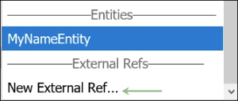

# Introduction to the MarkLogic Design System Storybook

This StoryBook contains demos of the components found in the `@marklogic/design-system` library, along with the source code you can copy in order to use them. Some slight code modifications may be necessary (see below for Gotchas), but it should be a good guideline.

This documentation is meant to be used in conjunction with the [Official Ant v3 Docs](https://3x.ant.design/docs/react/introduce). This library is based off of **version 3** of Ant, so make sure to stick to the v3 docs.

This page contains:

[Information for Developers](#for-developers)

[Information for Designers](#for-designers)

# For Developers

## How to customize theme colors

In your webpack.config.js or config-overrides.js, provide the Less loader the `modifyVars` option, defining any `less` variables you want to override. There is an example at `@marklogic/design-system/src/theme-variables.json`.

See [Ant's page on customizing the theme](https://3x.ant.design/docs/react/customize-theme) for more detail and a full list of theme variables provided by Ant.


## How to use these components

### Basic component usage:
- This works for all components that are exported in `@marklogic/design-system/src/index.js`

- ```jsx
import { MLButton } from '@marklogic/design-system'
```

### Some components are nested inside others, eg `MLInput.MLGroup`:

- These generally are matched to how Ant organizes their components

- Like Ant, these have displayNames like `MLInputGroup` in Story Source panels, but should be used like so:

- (These displayNames may be updated to be less confusing in a future update.)

- ```jsx
import { MLInput } from '@marklogic/design-system'
const { MLGroup } = MLInput // or use MLInput.MLGroup directly, in your JSX
```

## Icons

### Icon Documentation

Note that, unlike other Ant components, you should reference the [v4 documentation specifically for Icons](https://ant.design/components/icon/), since that is a separate package that we use the v4 version for.

Additionally, we have wrapped the [FontAwesome icons](https://fontawesome.com/icons?d=gallery&s=regular,solid&m=free), which have been renamed to be in PascalCase, and are available in MLIcon as well. Eg: the `align-center` icon is available as `<AlignCenter />`

### Icons must be imported differently, in order to be tree-shaken properly.
- It is not recommended that you import MLIcon directly, as that will include all Ant and FontAwesome icons in your bundle.

- Instead, do:
```
import { CheckCircleOutlined } from '@marklogic/design-system/es/MLIcon'
```


## Storybook Gotchas

How StoryBook renders Story Source blocks:

- Source blocks show what React components are rendered, and their props (and any other HTML elements in the story). Other source code that goes into a story does not generally display in the Story Source panel.

- When showing you the source code for a story, StoryBook displays function props as `noRefCheck`, rather than showing the function contents. When copying from these stories, you will have to provide actual functions here instead. In most cases, Ant is better reference for what functions are appropriate for these props.

- StoryBook will also "collapse" dynamically determined values into whatever their final concrete value is, as it was passed into the React component props. Eg `{ someProp: someCondition ? true : false }` will render only as `{ someProp: true }` (or false, whichever it ended up being)

- StoryBook Source does not show the `key` pseudo-prop (because it is not a prop). Often `key` is necessary for certain functionality, like `MLTabs` tabs activating when clicked. See the [React key documentation](https://reactjs.org/docs/lists-and-keys.html) for more context on this.


# For Designers

## General On-Screen Text Guidelines

### Considerations for Writing On-Screen Text
When composing text for MarkLogic UIs, bear in mind that:
* Users tend to scan until they find the information they need. For example, someone using an advanced search function might scan a list of control labels to locate the field most relevant to their current search.
* Users are unlikely to remember information from a previous screen.
* When a screen appears cluttered with a wall of text, users are likely to ignore it or feel overwhelmed.

To address these factors:
* Use keywords and short, precise terms to help users find the information they need when performing specific tasks.
* Do not rely on human memory. Repeat or link to critical information to reduce errors and user frustration.
* Edit text for brevity.

### Style
Avoid passive voice because it creates ambiguity. Active voice engages readers and enables brevity and clarity. Examples:

* **Bad**: Value entered must be a number.
* **Good**: Enter numbers only.
Avoid phrases like "by means of" because they do not add meaning. Replace long phrases with simpler words. Examples:

Bad	| Good
--- | ---
In order to	| to
In order for	| for
As well as | and
By means of which |	use or using


Avoid "should" because it is indefinite, implies that the product does not work, or sounds like you are scolding the reader. Instead, use specific and direct language. Examples:

Bad	| Good
--- | ---
You should change the default admin password.	| Change the admin password.
The result should display in the lower window. |	The result displays in the lower window.

"Should" is appropriate for troubleshooting instructions such as:
* Data Hub Framework should do X, but does Y instead.

Avoid vague adjectives and adverbs that do not add meaning such as "very," "extremely," and "about." Instead, use quantities and precise terms whenever possible.

Avoid the "simple" and "simply." If a user struggles to complete a procedure, reading "simple" or "simply" might make them feel foolish.

Remove or rephrase prepositions and prepositional phrases. Examples:
* **Bad**: You should free up the spindle before spinning.
* **Good**: Free the spindle before spinning.

Remove or rephrase adverbs. Examples:
* **Bad**: Tighten the screw thoroughly.
* **Good**: Tighten the screw.

Avoid contractions. Examples:
* **Bad**: You don’t have the proper permissions to run this query.
* **Good**: You do not have the proper permissions to run this query.

### Word Choice
Use title case for the Admin Interface, the tool that runs on port 8001. Examples:
* **Bad**: Admin interface
* **Bad**: Admin UI
* **Good**: Admin Interface

Dropdown versus pulldown: We refer to this component as drop-down list/menu or pull-down list/menu. See the [dropdown](http://marklogic-ui-component-library.eng.marklogic.com/?path=/docs/navigation-mldropdown--basic) component documentation for text guidelines.

Check box examples:
* **Bad**: checkbox or check-box
* **Good**: check box
* Note: Check boxes are selected, not clicked. Use select and unselect when referring to check boxes.

Use "allow" and "enable" correctly. Enable refers to capability while allow refers to granting permission. Examples:
* MarkLogic products enable data integration.
* Customers who purchase Operational Data Hub are allowed access to MarkLogic University.

Use "may" and "can" correctly. Can refers to capability while may refers to permission. Examples:
* If you have administrative access, you can modify settings in Data Hub.
* You may request administrative access by contacting the chief administrative officer in your organization.

Use "following" and "preceding" rather than "above" and "below" unless you are referring to a static image. Examples:
* **Bad**: The table below explains the options.
* **Good**: The following table explains the options.

### Usage 
#### Truncated Text
Truncation is the intentional removal of character data to shorten strings to make them fit within a given visual area in the UI. Guidelines:
* Truncate text only when necessary.
* Use an ellipsis to show that a text string has been truncated.

### Instructions and Procedures 
Do not use please in instructional text. Instead, use the imperative. Examples:
* **Bad**: Please set up your e-mail address to receive notifications.
* **Good**: Set up your e-mail address to receive notifications.

### Hints
Use dynamic help text for instructions about a specific field. Guidelines:
* If necessary, a hint may contain a sentence and sample syntax together.
* Use [Sentence case](https://elementary.io/docs/human-interface-guidelines#capitalization) for phrases. Do not end a phrase  with a period.
* Use [Sentence case](https://elementary.io/docs/human-interface-guidelines#capitalization)for hint text. End the sentence with a period.
* For syntax examples, write the code exactly as it appears in the UI. For example: 
  * mlUpdateIndexes
* Write short, direct, informative, and grammatically correct text. Avoid jargon and include proper punctuation and consistent capitalization. Examples:
  * **Bad**: You can customize your dashboard by finding the master list of commands and then typing the proper commands on the command line. If you receive an error, such as 1*&^099, refer to the master list of commands for the proper syntax. 
  * **Good**: You can customize your dashboard with column sorting, column configuring, and searching and filtering.

### Abbreviations and Acronyms
Only use these approved abbreviations:
* ARN for Amazon Resource Name                  
* CIDR for Classless inter-domain routing           
* DN for Distinguished Name                       
* DNS for Domain Name System                    
* GB for Gigabytes
* ID for Identification
* IP for Internet Protocol                          
* KB for Kilobytes
* LDAP for Lightweight Directory Access Protocol   
* Max for Maximum [Mastering]                  
* MB for Megabytes
* MCU  for MarkLogic Capacity Unit                  
* MLCP for MarkLogic Content Pump [Ingestion step]
* ODB for Open Database Connectivity       
* PII for Personally Identifiable Information [Entities]
* TB for Terabytes
* URI for Uniform Resource Identifier              
* URI for Uniform Resource Identifier [Across app]
* VNET for Azure Virtual Network
* VPC for Virtual Private Cloud

Only use these approved acronyms:
* [ACID](https://docs.marklogic.com/guide/copyright/glossary#ACID)
* [BLOB](https://docs.marklogic.com/guide/copyright/glossary#BLOB)
* [CRUD](https://docs.marklogic.com/guide/copyright/glossary#CRUD)
* [CURIE](https://docs.marklogic.com/guide/copyright/glossary#CURIE)
* [FLWOR](https://docs.marklogic.com/guide/copyright/glossary#FLWOR_statement)
* [JSON](https://docs.marklogic.com/guide/copyright/glossary#JSON)
* [LDAP](https://docs.marklogic.com/guide/copyright/glossary#LDAP)
* [MIME](https://docs.marklogic.com/guide/copyright/glossary#MIME_type)
* [PEP](https://docs.marklogic.com/guide/copyright/glossary#PEP)
* [POJO](https://docs.marklogic.com/guide/copyright/glossary#POJO)
* [REST](https://docs.marklogic.com/guide/copyright/glossary#REST)
* [SKOS](https://docs.marklogic.com/guide/copyright/glossary#SKOS)
* [SOAP](https://docs.marklogic.com/guide/copyright/glossary#SOAP)
* [URN](https://docs.marklogic.com/guide/copyright/glossary#URN)

### Capitalization 
Use [Title Case](https://elementary.io/docs/human-interface-guidelines#capitalization) for titles, headings, buttons, and labels.
Use [Sentence case](https://elementary.io/docs/human-interface-guidelines#capitalization) for lists, body text, or any copy that includes a grammatically complete sentence. 
For trademarks, servicemarks, Gradle tasks, file paths, database names, and case-sensitive commands, follow the capitalization exactly as it appears in the UI. Examples:
* ml-data-hub
* java -jar marklogic-datahub*.jar

Start list items with a capital letter. Examples:
* Technology
* Databasers
* Compliance

For compound words, capitalize the first letter of the first word. Example:
* On-screen text

### Grammar
Do not use (s) for plurals. Examples:
* **Bad**: Select the product(s) that you want to remove.
* **Good**: Select the products that you want to remove.

### Numbers
* Spell out zero through nine.
* Use numerals for 10 and above.

### Punctuation 
#### Apostrophes
Use apostrophes to: 
* Form possessives of nouns. Example:
  * Operational Data Hub is one of MarkLogic's best selling products.
* Indicate certain plurals of lowercase letters when it is not possible to write around letter plurals. Examples:
  * Writing around plural letters: Many code blocks include x and y variables.
  * Plural lowercase letters: Many code blocks include several variables such as j's, q's, x's, and y's.

Do not use apostrophes to indicate possessive when writing the word its. Examples:
* **Bad**: To add a host, enter it's IP address.
* **Good**: To add a host, enter its IP address.

#### Commas
When writing a series of three or more items, include the last comma before or or and (the [serial comma](https://www.statisticssolutions.com/comma-usage-in-apa-editing/)).
Example:
* MarkLogic serves clients in a variety of industries such as insurance, healthcare, life sciences, and financial services.

#### Colons and Semicolons
Use colons to introduce a bulleted list. Example:
MarkLogic services include:
* Digital Transformation
* Mainframe to NoSQL
* Operational Data Hub

Use semicolons:
* To link two independent clauses that are closely related in thought. Example:
  * Setting the memory settings incorrectly can adversely affect performance; if you need to change the settings and you have an active maintenance contract, you can contact MarkLogic Support for help.
* Between items in a list  if any of the items contain commas. Example:
  * Requirements might also include: Enriching data by iteratively processing, identifying, and tagging references within the data; transforming properties, modeling relationships between entities using triples; mastering your data to match and merge duplicates
  
#### Ellipsis 

End phrases with an ellipsis (…) if asking users to wait for something to load or change.
* Example: Please wait. Getting your network status….”

Use the ellipsis character (…) to inform users that:
* The entire string is available by drilling down or some other action that users can take within the UI.
* Text has been truncated.
Example:


#### Exclamation Points
Avoid exclamation points unless the message is urgent. Examples:
* **Bad**: The search returned zero results!
* **Good**: The search returned zero results.

#### Hyphens and Dashes
Avoid dashes.
Use hyphens to join two or more words when they come before a noun they modify and act as a single idea. Examples:
* Future-ready data platform
* Non-breaking space
Use hyphens for number ranges. Do not put a space on either side. Example:
* 5-12
Use hyphens for interjections or parenthetical phrases. Do not put a space on either side. Example:
* Simplify batch procedures-often lengthy and complex processes-with MarkLogic tools.

#### Periods
Fragments and headings do not require periods. Examples:
* **Bad**: Feature-rich and Built for the Enterprise.
* **Good**: Feature-rich and Built for the Enterprise
Use a period at the end of a complete sentence. Examples:
* **Bad**: Enter a valid string
* **Good**: Enter a valid string.

#### Punctuation and Quotation Marks
For standard text:
* Place periods inside quotation marks. Examples:
  * **Bad**: “We couldn’t do this with other technologies. We’re delivering these capabilities to our customers in ways that are wickedly performant”.
  * **Good**: “We couldn’t do this with other technologies. We’re delivering these capabilities to our customers in ways that are wickedly performant.”
* Place commas inside quotation marks. Examples:
  * **Bad**: “We couldn’t do this with other technologies such as SQL", explained MarkLogic CEO Gary Bloom.
  * **Good**: “We couldn’t do this with other technologies such as SQL," explained MarkLogic CEO Gary Bloom.
* Place question marks and exclamation points inside the quotation marks if they are part of the quotation. Examples:
  * The new employee asked, "May I have administrative access to Operational Data Hub?"
  * "This behavior is not acceptable in the workplace!" exclaimed the Vice President of People.
* Place question marks and exclamation points outside quotation marks if they are not part of the quotation:
  * Does the Senior Vice President of Engineering always say, "Code is king"?
  * I can't believe he told me "not to worry about data security"!
* For commands with items inside quotation marks, write them exactly as they appear in the UI. Example:
 ```   
declareUpdate();
xdmp.documentSetQuality("/test.json","10");
=> ()
```
    
#### Separating Words
Do not use / to separate words. Examples:
* **Bad**: X/Y
* **Good**:
  * X or Y
  * X and Y
  * X, Y, or both
  
### Links
For embedded and anchored links:
* Write short, descriptive link text (four or fewer words).
* If the title contains four or fewer words, use the target page or section title as link text. Examples:
  * Bad: [See Locator Element Record Navigation Procedure Section B.](https://wiki.marklogic.com/display/ENGINEERING/On-screen+Text+Guidelines)
  * Good: See [Operational Data Hub](https://www.marklogic.com/solutions/enterprise/operational-data-hub/) for details.
  
### Use of MarkLogic Server and MarkLogic
See [Documentation Style Guidelines](https://wiki.marklogic.com/display/ENGINEERING/Documentation+Style+Guidelines) for proper syntax.


## Accessibility 
* Color is not the only indicator of information
* Hover text on all icons
* Use colorblind-safe colors
* Keyboard navigation to all screen elements.

[Keyboard Navigation Table](https://wiki.marklogic.com/x/2xs2Cg)
