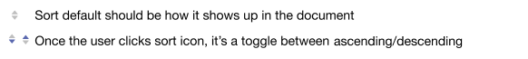
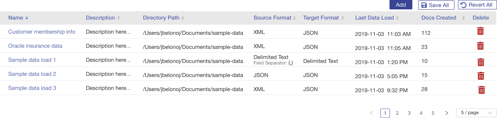
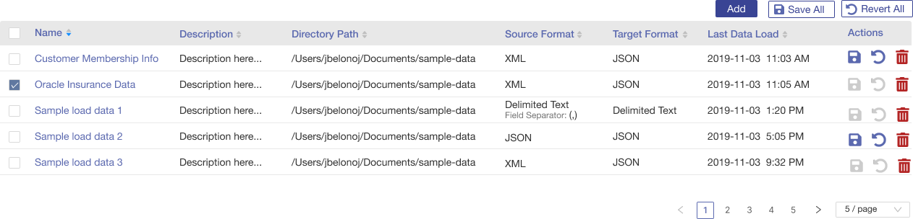
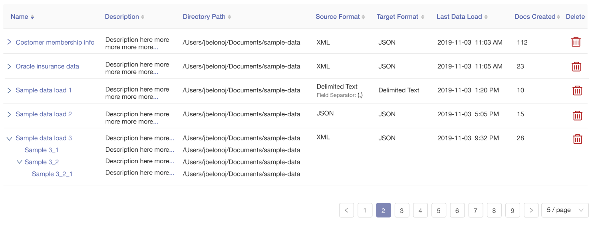
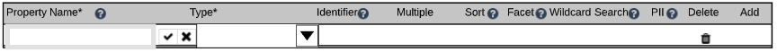
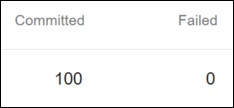

import { Meta, Story, Preview, Props } from '@storybook/addon-docs/blocks';
import PropsPanels from './PropsPanels';
import MLTable from '../src/MLTable';

# MLTable

[Ant Documentation](https://3x.ant.design/components/table)

## Usage Guidelines
* Icon columns in tables should be center-aligned
* Numeric columns in tables should be right-aligned, unless the number is an ID of some sort.
* If numeric data has decimal points, need to add trailing zeroes to make sure decimal points line up.
### Sorting
* Sorting should be persistent 

### Single Action Table
* Items in the first column "Name" are linked to view/edit the item's details
* For an action column with a single icon, use the icon's purpose as a heading
* If any item in the table is truncated, show full value on "..." hover
* Show description on hover for all icons

### Multiple Action Table
* For an action column with multiple icons, use "Action" as a generic heading
* For selectable rows, add checkboxes to the first column and include check all/uncheck all checkbox as a heading

### Table with Expandable Rows
* Use caret to expand/collapse tree data

### Required Fields
If a table column contains edit-in-place fields (text or choices), and it is required that the field be filled in, place an asterisk after the column name, as shown in the Property Name and Type columns here: 

### Help Text
As per above, if there is help text specific to the column, like restriction on content or an explanation of the column, use a ? icon immediately after the name, and place the help text in a popup that is activated by clicking on the icon. See the picture above.

## Text Guidelines
Avoid "number of" in table cells. Simply list the number. 

When there is no content, show a message of this form: "There are currently no &lt; data type &gt;."

<PropsPanels of={[
  MLTable,
]} />
