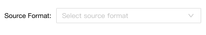
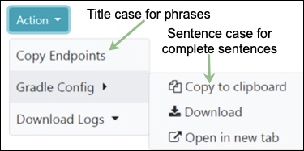

import { Meta, Story, Preview, Props } from '@storybook/addon-docs/blocks';
import PropsPanels from './PropsPanels';
import MLDropdown from '../src/MLDropdown';

# MLDropdown
There's nothing here yet.

[Ant Documentation](https://3x.ant.design/components/dropdown)

# MLDropdown.MLButton
There's nothing here yet.

<PropsPanels of={[
  MLDropdown,
  MLDropdown.MLButton,
]} />

# UX Design Guidelines
## Usage Guidelines
If a drop-down has no default value, it should include placeholder text, of the form "Select...".

## Text Guidelines
For dropdown labels:
* Use Title Case for phrases.
* Use Sentence case for grammatically complete sentences.
* Avoid punctuation.
* Use short, precise terms.
* Write dropdown labels to match page titles.

