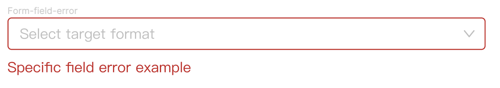
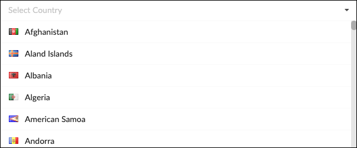

import { Meta, Story, Preview, Props } from '@storybook/addon-docs/blocks';
import PropsPanels from './PropsPanels';
import MLSelect from '../src/MLSelect';

# MLSelect

[Ant Documentation](https://3x.ant.design/components/select)

There's nothing here yet.

# MLSelect.MLOption

There's nothing here yet.

# MLSelect.MLOptGroup

There's nothing here yet.

## Usage Guidelines
### Form field error

* Any errors should use error color from the color pallet. 
* Highlight input field in error color, place error text below the field:

    
 
* If the error is a missing required field, the text should be "&lt;fieldname&gt; is required".

### Text Guidelines
For select options:

* Use Title Case.
* Avoid punctuation.
* Use short, precise terms.

Example:

   

<PropsPanels of={[
  MLSelect,
  MLSelect.MLOption,
  MLSelect.MLOptGroup,
]} />

