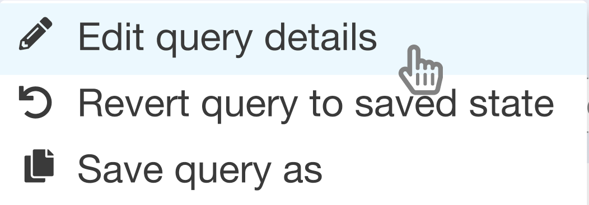
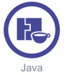

import { Meta, Story, Preview, Props } from '@storybook/addon-docs/blocks';
import PropsPanels from './PropsPanels';
import MLIcon from '../src/MLIcon';

# MLIcon

[Ant Documentation](https://ant.design/components/icon)

## Importing and usage

MLIcon importing and usage is different from the other components, to mirror the way Ant v4's icons work.

In your config-overrides, you must have this entry (as an argument to `override(...)`):
(Note that while under normal circumstances, you could omit the "es/" part in all of this, but TypeScript requires that all imports come from a real location, even if that code gets transformed by webpack later. So leave the "es/" part in.)
```jsx
fixBabelImports('@marklogic/design-system/es/MLIcon',
  {
    libraryDirectory: '',
    camel2DashComponentName: false,
    customName: function (name) {
      return `@marklogic/design-system/es/MLIcon/${name}`
    },
    style: function() {
      return '@marklogic/design-system/es/MLIcon/style'
    },
  },
),
```

To import an icon, you must do so like this:
```jsx
import { UserOutlined } from '@marklogic/design-system/es/MLIcon'
```

(For reference, the fixBabelImports plugin takes this import style, and transforms it to end up like this. You don't need to use this code directly, ever):
```jsx
import '@marklogic/design-system/es/MLIcon/style'
import UserOutlined from '@marklogic/design-system/es/MLIcon/UserOutlined'
```

Then to use the icon:
```jsx
<UserOutlined/>
```

## Notes about FontAwesome vs Ant icons

MLIcon includes icons from both Ant and FontAwesome, both exposed via Ant's icon API. All Ant Icon props are available for these icons, including the FontAwesome icons.

### Ant icons

Ant icons are exposed given their usual name; eg UserOutlined, CloseCircleFilled, etc.

Ant icon styles included:

- Filled
- Outlined
- TwoTone


### FontAwesome icons
FontAwesome icons are renamed to be UpperCamelCase and without the "fa" prefix, and the style name as the suffix; eg instead of using `<i class="fa fa-address-book"></i>`, the icon is available as `<AddressBookRegular/>` or `<AddressBookSolid/>`, etc, depending on which style of icon you're using.

The `500px` icon is available as `_500pxBrand`, because JavaScript variables cannot start with a number.

FontAwesome icon styles included:
- Regular
- Solid
- Brand


## Usage Guidelines
### Icon Sizes
Location | Size 
-------- | ----
Within a button, with text | 16
Action icon in a table | 20
Inline edit icons | 20
? icon next to a form field | 12
Error icon within a text field (table) | 16
info/error/warning icon in an alert | 24

### Info Icon for Form Element
Use help icon, place it to the right of the form field:


### Icon Colors
1. Link icons and save icons are component purple (#5B69AF) 
2. Utility icons are #777777 (example expand all / collapse all icons) 
3. Descriptive / Not clickable icons are text color (generally #333333, or match text color) 

## Text Guidelines
For icon labels:
* Use [Title Case](https://elementary.io/docs/human-interface-guidelines#capitalization). 
* Avoid ellipses, question marks, or any punctuation.
* Use short, precise terms.



For icon hover text:
* When a phrase or sentence is required, use [Sentence case](https://elementary.io/docs/human-interface-guidelines#capitalization).
* If the hover text is the name of a command or function, follow the case of the original command, function name, API name, or parameter name. 
* Do not use punctuation unless the text is a complete sentence.
* Use short, precise terms.


<PropsPanels of={[
  MLIcon,
]} />
