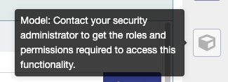

import { Meta, Story, Preview, Props } from '@storybook/addon-docs/blocks';
import PropsPanels from './PropsPanels';
import MLButton from '../src/MLButton';

# MLButton

[Ant Documentation](https://3x.ant.design/components/button)

## Usage Guidelines

### Primary Button
* the most important button on the page
* button we want to encourage user to click
* button that will enable user to move forward

### Default (Secondary) Button
* secondary actions
* alternative actions to the primary action 

### Danger Button 
* for actions that can have a severe consequence (e.g. terminating data hub service)

### Disabled Button
* If a button represents an action for which the current user does not have permission, the button should be disabled and appropriate hover text should be provided:

## Text Guidelines
For button labels:
* Use title case. 
* Avoid ellipses, question marks, or any punctuation.
* Use short, precise terms.
* Use descriptive label on the add button when there is no context about what you are adding, e.g. "Add Property", "Add to Filter", etc.

<PropsPanels of={[
  MLButton,
]} />
