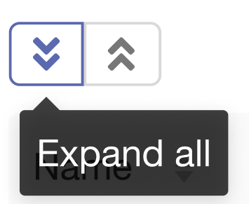

import { Meta, Story, Preview, Props } from '@storybook/addon-docs/blocks';
import PropsPanels from './PropsPanels';
import MLCollapse from '../src/MLCollapse';

# MLCollapse

[Ant Documentation](https://3x.ant.design/components/collapse)

# MLCollapse.MLPanel

## Usage Guidelines
### Password Hints

### Expand/Collapse All
Use this component when you need expand all/collapse all functionality. There should be tooltips on hover that say "Expand all" and "Collapse all".

## Text Guidelines
* Use [Title Case](https://elementary.io/docs/human-interface-guidelines#capitalization) for the title.
* When the collapse component includes table headings, use [Title Case](https://elementary.io/docs/human-interface-guidelines#capitalization).

<PropsPanels of={[
  MLCollapse,
  MLCollapse.MLPanel,
]} />
