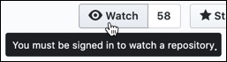

import { Meta, Story, Preview, Props } from '@storybook/addon-docs/blocks';
import PropsPanels from './PropsPanels';
import MLTooltip from '../src/MLTooltip';

# MLTooltip

[Ant Documentation](https://3x.ant.design/components/tooltip)

## Usage Guidelines
No Guidelines

## Text Guidelines
For tooltip text:
* Use [Sentence case](https://elementary.io/docs/human-interface-guidelines#capitalization).
* Text in tooltip should end with a period.
* Do not write more than two lines of text.
* Write short, direct, and informative text.

<PropsPanels of={[
  MLTooltip,
]} />
