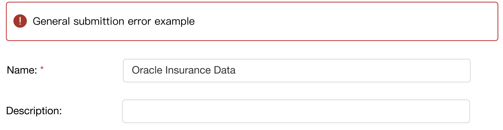
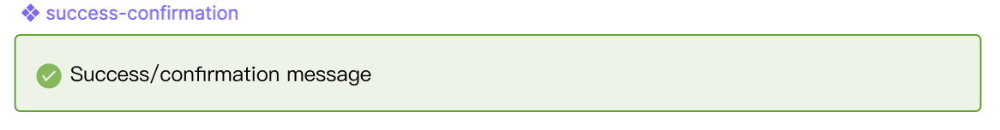
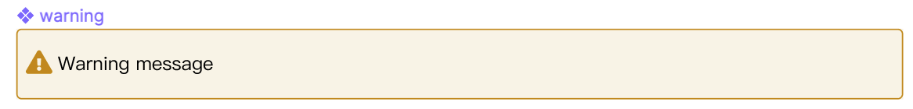
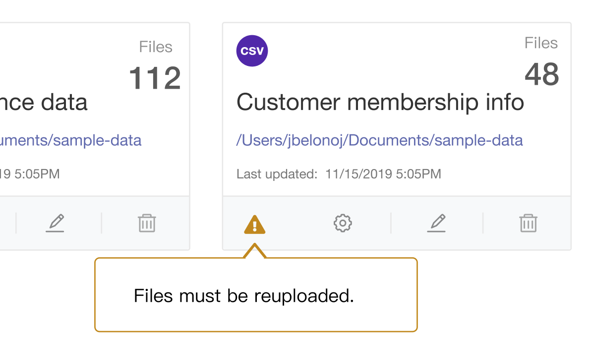
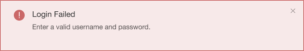

import { Meta, Story, Preview, Props } from '@storybook/addon-docs/blocks';
import PropsPanels from './PropsPanels';
import MLAlert from '../src/MLAlert';

# MLAlert

[Ant Documentation](https://3x.ant.design/components/alert)

## Usage Guidelines
### Page Level Alert 
Use error alert at the top of the page to display page level errors:

### Confirmation/Success
Use success alert; make it automatically go away after a few seconds:

### Warning
#### Warning Message
Use warning alert; make it automatically go away after a few seconds:

#### Warning Icon with Message on Mouseover 
Warning icon with on mouse-over text can be placed in different parts of the page, for example:

## Text Guidelines
* Use [Title Case](https://elementary.io/docs/human-interface-guidelines#capitalization) for the message heading. 
* For message text, use plain language to explain what happened and why. If the alert refers to an error:
  * Do not blame the user. Avoid all caps, and use a neutral, professional tone.
  * Suggest the next step, and use [Sentence case](https://elementary.io/docs/human-interface-guidelines#capitalization) if the text forms a complete sentence.
 

<PropsPanels of={[
  MLAlert,
]} />
