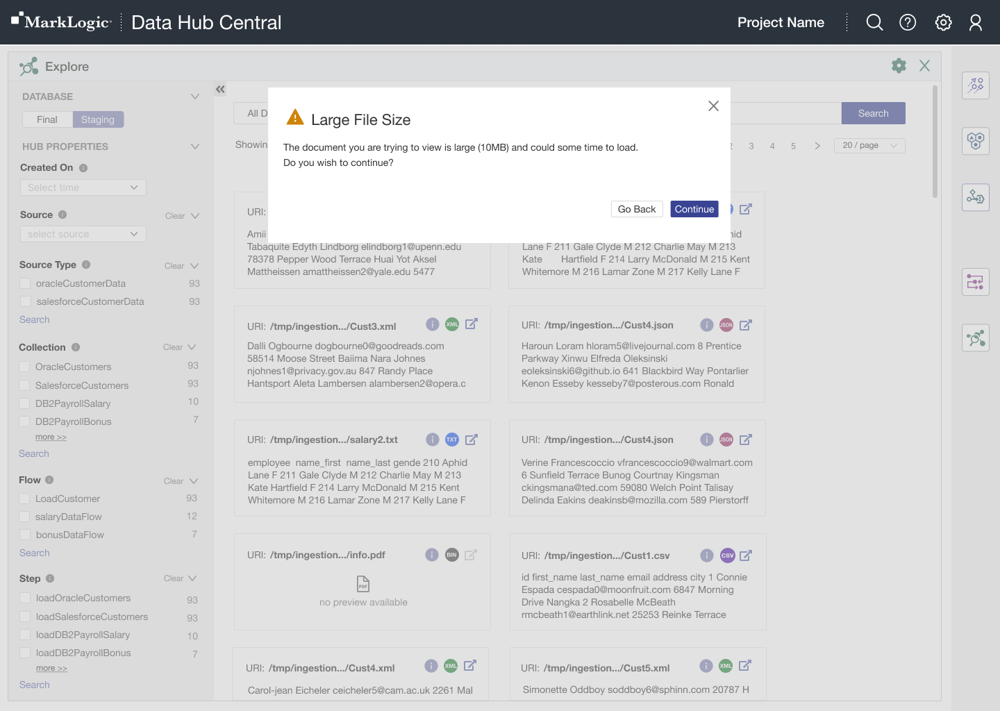
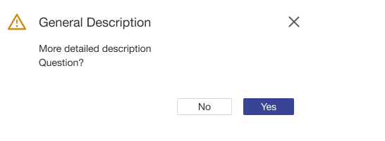

import { Meta, Story, Preview, Props } from '@storybook/addon-docs/blocks';
import PropsPanels from './PropsPanels';
import MLModal from '../src/MLModal';

# MLModal

[Ant Documentation](https://3x.ant.design/components/modal)

There's nothing here yet.

# MLModal.MLDraggableModalProvider

There's nothing here yet.

## Usage Guidelines
Use modal to get user's input. Modal creates a mode that disables the main window but keeps it visible with the modal window as a child window in front of it. 
* Background color behind modal: #C4C4C4 50% Opacity
* Close icon: Ant CloseOutlined 20 X 20
* Buttons: Bottom right corner

Use Modal for to communicate to the user confirmation/success or error messages without leaving the main page.

* The name of the action button should be the action, like Save, as opposed to just OK.
* If asking a yes/no question, the buttons should be No and Yes.
* If the dialog is simply giving information, or just showing the (readonly) details of an object, there should be one button, Close.

Use "Add" button to open Add modal, place it in the right corner above the element. Use "Cancel" and "Add" buttons at the bottom of the Add Modal to save or cancel your changes.

### Warning Modal for Rendering Large Files

If the UI is rendering a file greater than 5MB, this warning modal pops up on the page:
* Header should have warning icon in warning color, and say "Large File Size" 
* The body text should say: "The document you are trying to view is large (_insert document size here, if possible_) and may take some time to load. _new line_ Do you wish to continue?"
* 'Continue' should be a primary button
* 'Go Back' should be a secondary button 

### Confirmation Modals
If there is a confirmation modal that needs a description:
Header should be a concise description

The body should have 2 parts:
1. The description in more detail
2. The confirmation question (e.g. Do you wish to continue?)

'Yes' or equivalent should be a primary button

'No' or equivalent should be a secondary button 

## Text Guidelines
* Use the same text for the modal title and the button that launched it. In the following examples, the titles **Delete Object** would be launched by a button labeled **Delete** and **Create Object** by a button labeled **Create**.
* Use plain language to convey what users must do to proceed.
* For the button label use **Yes** or an explicit verb for the affirmative answer such as **Add**.

### Page/Modal Titles and Subtitles
Page title should be place in the top left corner of each page. It should concisely describe what the page is:

Page subtitle (optional). In some cases we use a combination of title and subtitle to provide enough context to the user:

### Field Labels 
* Do not capitalize all letters.
* Use title case for phrases. Do not use punctuation for phrases. 
* Use  sentence case if the text is a complete sentence
* Avoid "number of." Use precise terms to make it clear that the table cell value will be a number.
  * **Bad**: Number of documents to process
  * **Good**: Batch Size
* Avoid question marks.
  * **Bad**: Thread Count?
  * **Good**: Thread Count
* Use short, precise terms whenever possible.
* Use parallel structure when listing radios or check box options. If all options have the same introductory text, move that text to the group label.

<PropsPanels of={[
  MLModal,
  MLModal.MLDraggableModalProvider,
]} />
