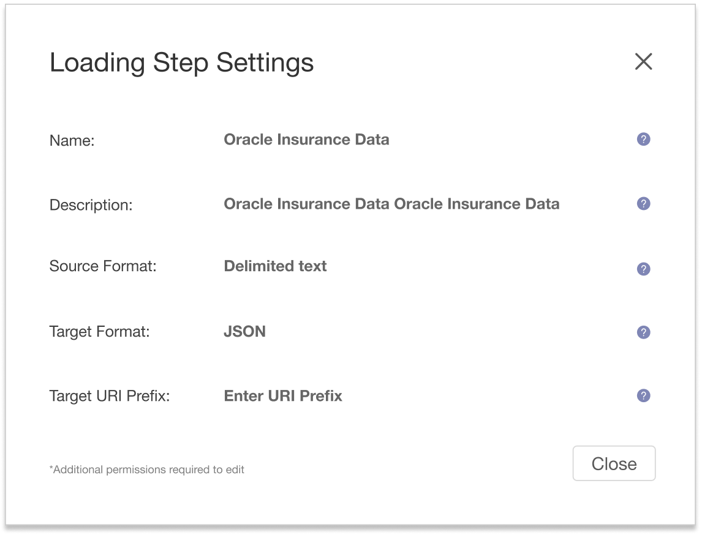

import { Meta, Story, Preview, Props } from '@storybook/addon-docs/blocks';
import PropsPanels from './PropsPanels';
import MLForm from '../src/MLForm';

# MLForm

[Ant Documentation](https://3x.ant.design/components/form)

There's nothing here yet.

# MLForm.MLItem

There's nothing here yet.

## Usage Guidelines
### Horizontal Usage
* default use

### Inline Layout
* can be used if placed in header or space is a constraint

### Verticle Layout 
* can be used if horizontal space is limited

### Password Hints

### Inline Help
#### Form Field Tooltips
Use help icon, place it to the right of the form field:

#### Info Popovers
Use help icon, place it to the right of the heading/text:

### Input Fields
If an input field has no default value, it should include placeholder text, of the form "Enter ...".

### Errors
Any errors should use the error color from our [color pallet](http://marklogic-ui-component-library.eng.marklogic.com/?path=/story/styles--color-palette).

#### Form Field Error
Highlight input field in error color, place error text below the field:

If the error is a missing required field, the text should be `<fieldname> is required`.

#### Form field error with limited space (for example, inside a table cell)
Use error icon inside the field with error text on mouse-over:  

### Handling Required Fields 
If a form has one or more required fields, DO NOT disable the Save (or equivalent) button if they are empty. Instead, display an error message as described above when the user hits Save.

### Read-Only Forms
When the user doesn’t have permission to edit something, deal with displaying the edit form as follows:
* Do not show inputs
* Show field values in bold text
* Remove  icons if they contain instructions how to fill in the form, keep  icons if they provide helpful content about the fields.
* "Close Button" will be right-aligned with "info icon."
* "info icon" should be 56 pixels from the longest sentence and all other info icons will right aligned with it.
* When you don't know the exact permissions/roles needed use "*Additional permissions required to edit" as guided text at the bottom of the page or card. 

## Text Guidelines
Use [Sentence case](https://elementary.io/docs/human-interface-guidelines#capitalization) for explanatory or instructional test.
For field labels:
* Do not capitalize all letters.
* Use [Title Case](https://elementary.io/docs/human-interface-guidelines#capitalization) for phrases. Do not use punctuation for phrases. 
Examples:

  **Bad**

  

  **Good**

  
  
* Use  [Sentence case](https://elementary.io/docs/human-interface-guidelines#capitalization) if the text is a complete sentence
* Avoid "number of." Use precise terms to make it clear that the table cell value will be a number. Examples:
  * **Bad**: Number of documents to process
  * **Good**: Batch Size
* Avoid question marks. Examples:
  * **Bad**: Thread Count?
  * **Good**: Thread Count
* Use short, precise terms whenever possible.
* Use [parallel structure](https://owl.purdue.edu/owl/general_writing/mechanics/parallel_structure.html) when listing radios or check box options. If all options have the same introductory text, move that text to the group label.

Examples:

**Bad**

  Search:
  - [ ] When searching an indexed database include company owner
  - [ ] When searching an indexed database include company name
  - [ ] When searching an indexed database include industry name
  
 **Good**
 
   When searching an indexed database, include:
  - [ ] Company Name
  - [ ] Company Owner
  - [ ] Industry Name

<PropsPanels of={[
  MLForm,
  MLForm.MLItem,
]} />
