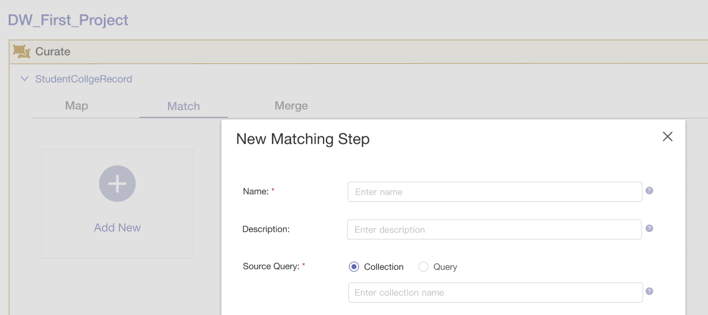
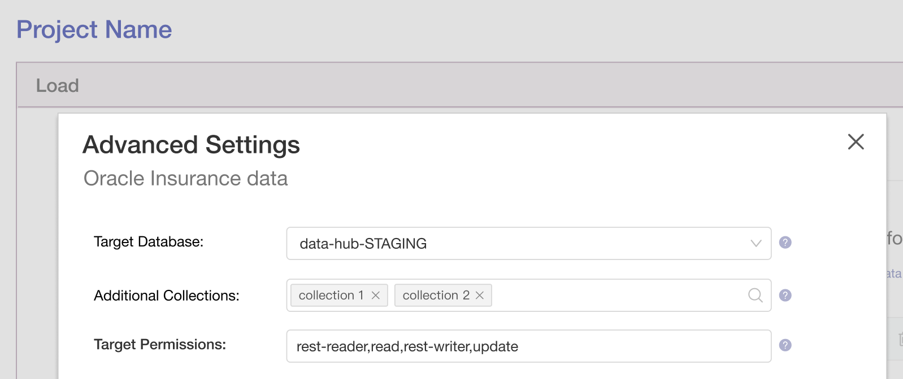

import { Meta, Story, Preview, Props } from '@storybook/addon-docs/blocks';
import PropsPanels from './PropsPanels';
import MLPageHeader from '../src/MLPageHeader';

# MLPageHeader

[Ant Documentation](https://3x.ant.design/components/page-header)

## Usage Guidelines
* Page title should be place in the top left corner of each page. It should concisely describe what the page is:

* Page subtitle (optional). In some cases we use a combination of title and subtitle to provide enough context to the user:

## Text Guidelines
When writing text for PageHeaders and sub-titles:
* Use [Title Case](https://elementary.io/docs/human-interface-guidelines#capitalization).
* Use short, precise terms.
* Choose words that reflect the content on that page.

<PropsPanels of={[
  MLPageHeader,
]} />
