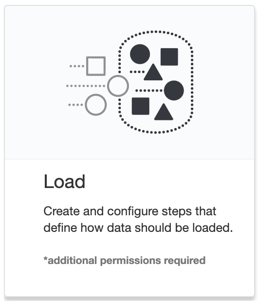

import { Meta, Story, Preview, Props } from '@storybook/addon-docs/blocks';
import PropsPanels from './PropsPanels';
import MLCard from '../src/MLCard';

# MLCard

[Ant Documentation](https://3x.ant.design/components/card)

There's nothing here yet.

# MLCard.MLGrid

There's nothing here yet.

# MLCard.MLMeta

There's nothing here yet.

## Usage Guidelines
### Add New card
* Use Ant's plus-circle icon, Link color and text "Add New":

### Existing card
* Use Ant's Card component:

* Footer icons are: Advanced Settings, Edit, Delete.

* Reduce card opacity to 20% and show navigational menu on mouse-over:

## Text Guidelines
* Use Title Case for the heading.
Example:

## Functionality Not Available
### Permission Text Guidelines
When functionality is not available on a card, place text on the card to tell the user why:
* Alignment of the permission text is dependent on the other information on cards. See images for some options.
* If the functionality is not available because of permissions, the exact wording of the text should be as described in the [Hints about Permission](http://marklogic-ui-component-library.eng.marklogic.com/?path=/docs/welcome--to-storybook)  spec.
* If the functionality is not available for some other reason, state the reason.

<PropsPanels of={[
  MLCard,
  MLCard,
  MLCard.MLGrid,
  MLCard.MLMeta,
]} />
