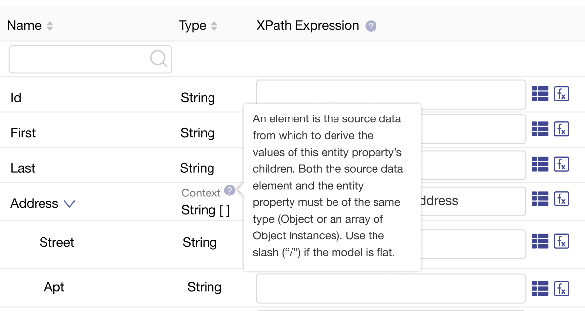
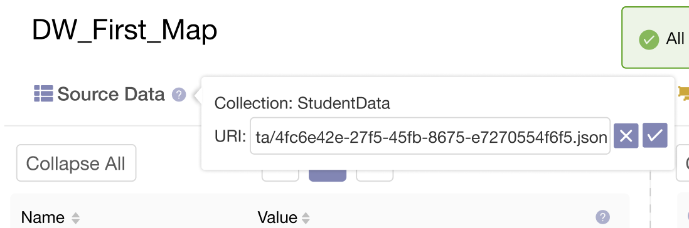
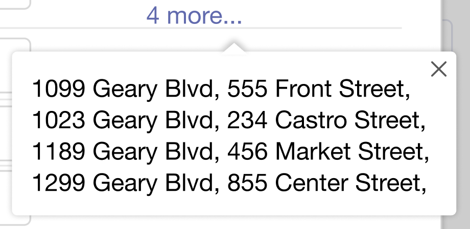

import { Meta, Story, Preview, Props } from '@storybook/addon-docs/blocks';
import PropsPanels from './PropsPanels';
import MLPopover from '../src/MLPopover';

# MLPopover

[Ant Documentation](https://3x.ant.design/components/popover)

## Usage Guidelines
### Info Popovers
Use help icon, place it to the right of the heading/text:

### Info and Action Popovers
Use help icon, place it to the right of the text:

### Highlighted Text MouseOver (No Icon)
Mouse-over highlighted text to see a tooltip or a popover:

## Text Guidelines
For popover menu items:
* Use [Title Case](https://elementary.io/docs/human-interface-guidelines#capitalization).
* Avoid punctuation.
* Use short, precise terms.

<PropsPanels of={[
  MLPopover,
]} />
