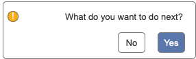
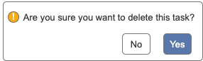

import { Meta, Story, Preview, Props } from '@storybook/addon-docs/blocks';
import PropsPanels from './PropsPanels';
import MLPopconfirm from '../src/MLPopconfirm';

# MLPopconfirm

[Ant Documentation](https://3x.ant.design/components/popconfirm)

## Usage Guidelines
No Guidelines

## Text Guidelines
* Use plain language to convey what the user needs to confirm.
* The sentence in a popconfirm must be a yes or no question.
Examples:

**Bad**

**Good**

<PropsPanels of={[
  MLPopconfirm,
]} />
